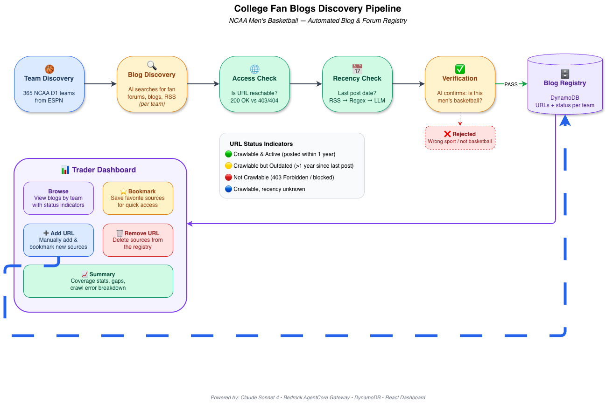

# College Fan Blogs Discovery Pipeline

An AI-powered pipeline that automatically discovers college-specific fan blogs and forums for a configurable input sport. The sport name, team discovery method, and blog search prompts are all defined in a config YAML file that serves as the pipeline's input. For each discovered URL, the pipeline checks accessibility and recency (when was the last post?), then stores verified results in a central registry.

**For traders:** No more manually curating Excel sheets of fan blog URLs. This pipeline automatically finds and validates fan blogs across all teams. A dashboard gives traders full transparency into what's been discovered — and lets them add their own favorite sources, bookmark them, or remove irrelevant ones. This dashboard will be integrated into FanDuel's main project UI, where a downstream blog search agent uses these discovered URLs to surface injury news, roster moves, and other trading signals.

## What It Does

For each team in the configured sport (currently 365 NCAA Division 1 men's basketball teams), the pipeline:

1. **Discovers** fan blogs, forums, and news sources via web search
2. **Checks accessibility** (is the URL reachable or bot-blocked?)
3. **Checks recency** (when was the last post? RSS → regex → LLM fallback)
4. **Verifies content** (is this actually men's basketball for this team?)
5. **Stores results** in DynamoDB with status indicators
6. **Serves a dashboard** for traders to browse, bookmark, and manage sources

## Project Structure

```
discovery/
├── run_discovery.py          # Main pipeline orchestrator
├── discovery_agent.py        # AI agent definitions (team, blog, verifier)
├── api_server.py             # REST API server (Python, serves dashboard data)
├── config/
│   └── ncaa_mbb.yaml         # Domain config: prompts, search queries, settings
├── tools/
│   ├── access_check.py       # HTTP accessibility check tool
│   ├── recency_check.py      # Last-post-date detection (RSS/regex/LLM)
│   └── http_fetch.py         # Page content fetcher for verification
├── dashboard/
│   ├── src/App.tsx            # React dashboard (Vite + TypeScript)
│   ├── vite.config.ts         # Vite config with API proxy
│   └── index.html
├── utils/
│   └── test_recency_check.py # Debug script for recency algorithm
├── docs/
│   ├── pipeline_flow.drawio          # Detailed flow diagram
│   └── pipeline_flow_simple.drawio   # Simplified flow diagram
├── output/                   # Generated files (Excel exports, logs)
├── .env_setup                # Template for environment variables
├── pyproject.toml            # Python dependencies
└── requirements.txt          # Alternative dependency list
```

## Setup

### Prerequisites

- Python 3.11+
- [uv](https://docs.astral.sh/uv/) (Python package manager)
- Node.js 18+ (for the dashboard)
- AWS account with:
  - Bedrock access
  - DynamoDB table (`blog-discovery-registry`)
  - Bedrock AgentCore Gateway (for web search MCP tool)
  - Cognito M2M credentials (for gateway auth)

### 1. Environment Variables

```bash
cp .env_setup .env
# Edit .env with your values
```

Required variables:
| Variable | Description |
|----------|-------------|
| `AWS_PROFILE` | AWS credentials profile name |
| `AWS_DEFAULT_REGION` | AWS region (default: `us-east-1`) |
| `GATEWAY_URL` | AgentCore Gateway MCP endpoint URL |
| `COGNITO_DOMAIN` | Cognito domain for M2M token exchange |
| `COGNITO_CLIENT_ID` | Cognito machine client ID |
| `COGNITO_CLIENT_SECRET` | Cognito machine client secret |
| `REGISTRY_TABLE` | DynamoDB table name (default: `blog-discovery-registry`) |

### 2. Install Python Dependencies

```bash
cd discovery
uv sync
```

### 3. Install Dashboard Dependencies

```bash
cd discovery/dashboard
npm install
```

### 4. Create DynamoDB Table

```bash
aws dynamodb create-table \
  --table-name blog-discovery-registry \
  --attribute-definitions AttributeName=team,AttributeType=S \
  --key-schema AttributeName=team,KeyType=HASH \
  --billing-mode PAY_PER_REQUEST \
  --region us-east-1
```

## Running the Pipeline

### Full run (all teams)

```bash
AWS_PROFILE=<profile> uv run python run_discovery.py \
  --config config/ncaa_mbb.yaml \
  --workers 7 \
  --debug 2>&1 | tee output/debug_run.log
```

### Single team

```bash
AWS_PROFILE=<profile> uv run python run_discovery.py \
  --config config/ncaa_mbb.yaml \
  --team "Duke Blue Devils" \
  --debug

```

### CLI Options

| Flag | Description |
|------|-------------|
| `--config` | Path to domain config YAML (required) |
| `--team` | Run for a single team (skips team discovery) |
| `--workers N` | Parallel workers (default: 1) |
| `--limit N` | Process only N teams (for testing) |
| `--debug` | Show agent reasoning, tool calls, search results |

## Running the Dashboard

Start both servers:

```bash
# Terminal 1: API server
cd discovery
AWS_PROFILE=<profile> uv run python api_server.py

# Terminal 2: Dashboard (Vite dev server)
cd discovery/dashboard
npm run dev
```

Open http://localhost:5173

### Dashboard Features

- **Summary tab**: Coverage stats, teams without sources, crawl errors
- **Team View tab**: Browse URLs per team, add/remove URLs manually, bookmark URLs
- **My Sources tab**: Bookmarked favorites across all teams

## Testing

### Test recency check for a specific URL

```bash
AWS_PROFILE=<profile> uv run python utils/test_recency_check.py \
  "https://acusports.com/sports/mens-basketball/archives"
```

### Test blog discovery for a single team

```bash
AWS_PROFILE=<profile> uv run python run_discovery.py \
  --config config/ncaa_mbb.yaml \
  --team "Colgate Raiders" \
  --debug
```

### Verify the API server

```bash
curl http://localhost:8080/api/registry | python -m json.tool | head -20
```

## Flow Diagram



## Recency Check Algorithm

Priority order for determining the last post date:

1. **RSS feed** — Parse `<pubDate>`, `<dc:date>`, or URL-embedded dates from the RSS
2. **Regex on visible HTML** — Strip `<head>/<script>/<style>/<meta>`, scan body for date patterns
3. **LLM fallback** — Send 50K chars of cleaned page text to Claude, ask for the most recent date

Status thresholds:
- `active`: last post within 365 days
- `outdated`: last post more than 365 days ago
- `unknown`: no date could be determined

## Team ID Normalization

Each team gets a stable `team_id` (lowercase, spaces/commas removed):
- "Arizona Wildcats" → `arizonawildcats`
- "Central Connecticut Blue Devils" → `centralconnecticutbluedevils`

On re-runs, discovered team names are matched against existing registry by `team_id` to prevent duplicates from formatting variations.

## Configuration

The domain config (`config/ncaa_mbb.yaml`) is the primary input to the pipeline. It defines what sport to discover blogs for, how to search, and what to accept/reject. To adapt this pipeline for a different sport (e.g., college football, NBA), create a new YAML config with appropriate prompts.

Config structure:
```yaml
domain_id: ncaa_mbb                    # Unique identifier for this sport
display_name: "NCAA Men's Basketball"  # Human-readable sport name
reference_date: null                   # Set to YYYY-MM-DD or null for today

team_discovery:
  query: "..."                         # User message sent to the team discovery agent
  primary_url: "..."                   # ESPN or other source for team list
  prompt: |                            # System prompt for team discovery agent
    ...

blog_discovery:
  query: "..."                         # User message template ({team}, {sport} placeholders)
  max_blogs_per_team: 10               # Max URLs to discover per team
  recency_threshold_days: 365          # Days before a blog is considered "outdated"
  prompt: |                            # System prompt: search queries, examples, rules
    ...

verifier:
  prompt: |                            # System prompt: accept/reject criteria
    ...
```

Key design decisions in the config:
- **Few-shot examples** in the blog discovery prompt guide the AI toward small independent forums
- **EXCLUDE/DO NOT EXCLUDE** rules control what types of sources are accepted
- **Subforum path patterns** help the agent find working URLs for bot-blocked sites
- **Verifier** accepts multi-sport sources as long as the target sport is covered

