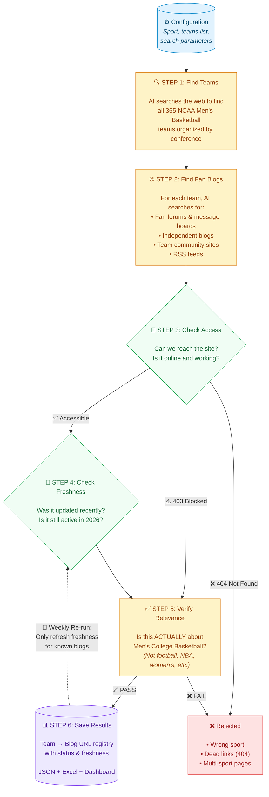

# Blog Discovery Pipeline

## How It Works

## Pipeline at a Glance

| Step | What Happens | Why |
|------|-------------|-----|
| 🔍 Find Teams | Discovers all 365 D1 teams | Complete coverage |
| 🌐 Find Blogs | Searches web for fan sites per team | Source discovery |
| 🚦 Check Access | Verifies sites are reachable | No dead links |
| 📅 Check Freshness | Confirms sites are actively posting | Only live sources |
| ✅ Verify Relevance | Confirms it's Men's Basketball | No noise from other sports |
| 📊 Save Results | Builds searchable registry | Ready for traders |

## Key Outputs

- **Registry JSON** — Machine-readable list of all verified blog URLs per team
- **Excel Report** — Sortable spreadsheet with team, blog, status, last post date
- **Dashboard** — Visual web app to browse results by team with color-coded status

## Weekly Re-runs

On subsequent runs, the pipeline is **smart about what it re-checks**:

- 🆕 **New blogs** → Full pipeline (search → access → freshness → verify)
- 📋 **Known blogs** → Only refresh freshness (saves time & cost)
